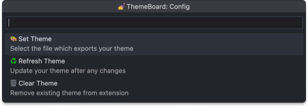
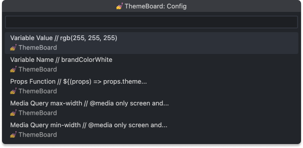

# ThemeBoard

ThemeBoard is a Visual Studio Code (VS Code) extension that allows you to copy the styled theme properties from your theme file to the clipboard directly from the VS Code Command Palette.

The extension is designed to work with styled-components, however it can parse any JS or TS theme object.

## Usage

### Config



### Commands



#### Variable Value

```css
#fff
```

#### Variable Name

```css
colorWhite
```

#### Props Function

```css
${(props) => props.theme.colorWhite}
```

#### Media Query (max-width)

```css
@media only screen and (max-width: ${(props) => props.theme.sizeMobile}) {}
```

#### Media Query (min-width)

```css
@media only screen and (min-width: ${(props) => props.theme.sizeMobile}) {}
```

## Accepted Formats

Your theme should be exported as an object. Nested children will be flattened. For example, `size.Mobile` will be copied if using variable name. Some examples are below...

```js
export const theme = {
  sizeMobile: '480px',
  sizeTablet: '768px',
  sizeDesktop: '1024px',
  sizeWidescreen: '1200px',
  colorRed: '#FF0000',
  colorOrange: '#FFA500',
  colorYellow: '#FFFF00',
  colorGreen: '#008000',
  colorBlue: '#0000FF',
  colorPurple: '#800080',
};
```

```js
const sizeMobile = '480px';
const sizeTablet = '768px';
const sizeDesktop = '1024px';
const sizeWidescreen = '1200px';
const colorRed = '#FF0000';
const colorOrange = '#FFA500';
const colorYellow = '#FFFF00';
const colorGreen = '#008000';
const colorBlue = '#0000FF';
const colorPurple = '#800080';

export const theme = {
  sizeMobile,
  sizeTablet,
  sizeDesktop,
  sizeWidescreen,
  colorRed,
  colorOrange,
  colorYellow,
  colorGreen,
  colorBlue,
  colorPurple,
};
```

```js
export const theme = {
  size: {
    Mobile: '480px',
    Tablet: '768px',
    Desktop: '1024px',
    Widescreen: '1200px',
  },
  color: {
    Red: '#FF0000',
    Orange: '#FFA500',
    Yellow: '#FFFF00',
    Green: '#008000',
    Blue: '#0000FF',
    Purple: '#800080',
  },
};
```
